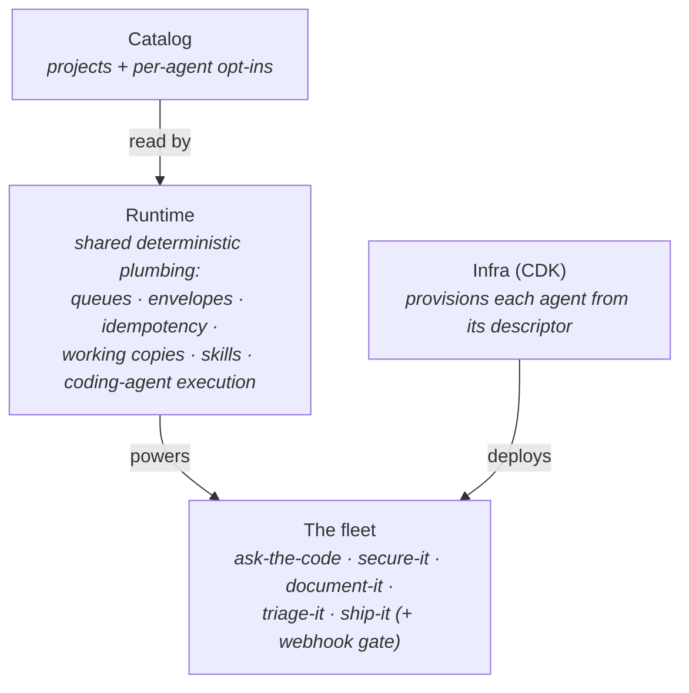
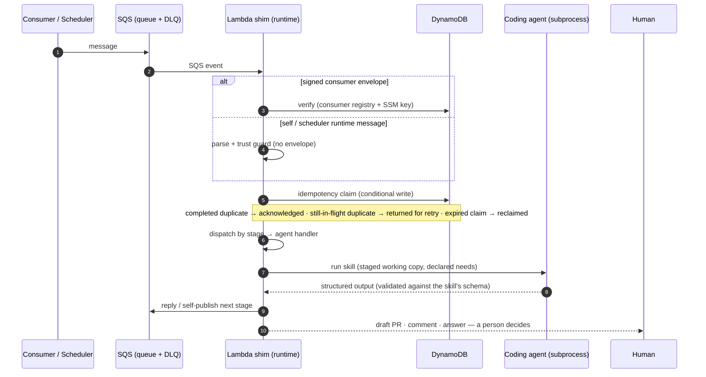

# Architecture

How the suite is put together and why. This page stays at the system level; each package README
documents its own internals (start with [`core/runtime`](../core/runtime/README.md)).

## Four layers

- **Catalog** ([`core/catalog-it`](../core/catalog-it/README.md)) — the canonical `Project` shape, a
  curation CLI, and read-side implementations (filesystem for local work, S3 bundle for deployed
  agents, in-memory for tests). Write-capable agents additionally gate on the project's
  `extensions["<agent-id>"].enabled === true` — catalog membership alone never grants write access.
- **Runtime** ([`core/runtime`](../core/runtime/README.md)) — everything mechanical, in plain
  TypeScript: the SQS Lambda shim, envelope verification, idempotency, stage dispatch, skill
  staging, working-copy sync, typed clients for declared needs, self-publishing, logging with
  correlation + secret redaction.
- **Agents** (`agents/*`) — one thin, independently deployable specialist per job. An agent is a
  descriptor (`agent.yaml`), per-stage handlers, and its entry-point skills. Agents never call each
  other.
- **Infra** ([`infra`](../infra/README.md)) — CDK that reads every registered descriptor and
  provisions what it implies: queue + DLQ pair, scheduler group/tick for scheduled agents,
  Lambda + IAM scoped to declared needs, and the webhook gate's Function URL stack. Application
  repos carry zero IaC.

## A message's life

Two kinds of message enter an agent, and they are deliberately not treated the same:

- **Consumer messages** (a question from a person, a normalized webhook event) arrive as
  **signed envelopes**: HMAC over canonical JSON, key resolved per consumer, sender registered in a
  DynamoDB **consumer registry** with the message kinds it may send.
- **Self/scheduler messages** (an agent's own follow-up stages, the recurring tick) are unsigned —
  the input queue is IAM-private to the agent and its scheduler role, so envelope signing (a
  consumer-boundary control) does not apply. A guard rejects unsigned bodies on agents that also
  accept consumer traffic unless the trust is explicitly acknowledged in the entry shim.

The mechanics, briefly:

- **Idempotency** — a conditional claim in DynamoDB whose states are completed, live in-flight,
  and expired/reclaimable in-flight (an ownership deadline decides liveness). SQS is
  at-least-once, so duplicates are expected: a duplicate of **completed** work acknowledges as
  `duplicate-completed` without re-running the skill; a duplicate of work **still in flight** is
  returned to the queue for a later retry; an in-flight claim whose ownership deadline has passed
  can be **reclaimed** by the next delivery.
- **Stages** — multi-step agents (e.g. secure-it's `init → breakdown → revisit`) self-publish their
  next stage: `publish` sends straight to the agent's own queue; `publishDelayed` creates a
  one-shot EventBridge Scheduler schedule. The schedule's name is derived from
  `{agent, stage, payload}`, so re-publishing the same logical work dedupes onto the first
  schedule.
- **Skills** — the unit of agent behavior: a focused instruction set with declared input/output
  schemas. The runtime stages the agent's own skills (falling back to runtime-bundled support
  skills), mounts the synced working copy, runs the coding agent (Claude or Codex) as a
  subprocess, and validates the output against the skill's schema. Tests swap in a fake runner —
  no live model needed.
- **Needs** — an agent declares what it touches (`github`, `sqs`, `s3`, …); the runtime wires typed
  clients and infra derives IAM from the same declaration. Undeclared access fails loudly.

## Running it locally

The production seams reproduce on a laptop:

- **`run-local` CLI** — feeds one message through the real dispatch/skill path with a filesystem
  catalog and a local working copy; `--fake-runner` for plumbing smoke tests, the real runner for
  end-to-end proofs. (Draining self-published fan-out messages in a loop is a known gap — today
  `run-local` processes the one message it is given.)
- **LocalStack integration suites** — every core package and agent ships `test:integration`
  against real AWS SDK calls routed to LocalStack (`docker compose up -d localstack`). The harness
  fails loudly when LocalStack is unreachable rather than skipping. One honest limitation:
  LocalStack Community's EventBridge Scheduler is CRUD-only (schedules never fire), so the suite
  verifies the full `CreateSchedule` contract and simulates the fire byte-for-byte.
- **Lambda rehearsal** (ask-the-code) — builds the real container image and exercises it through
  the AWS Runtime Interface Emulator against LocalStack: the closest-to-production path that runs
  on a laptop.

## Design decisions worth knowing

- **No central brain.** Coordination happens where humans already coordinate — the ticket and the
  PR. This keeps agents independently adoptable and independently failable.
- **Deterministic plumbing, judgment at the edge.** The runtime never asks a model to do something
  code can do. This is simultaneously the cost story, the predictability story, and the
  testability story.
- **Descriptor-driven everything.** `agent.yaml` is the single declaration: the runtime validates
  against it, infra provisions from it, and the registry⇄descriptor consistency is enforced by
  tests.
- **Fail loud, never silently degrade.** Unreachable LocalStack throws; undeclared needs throw;
  unverifiable envelopes are rejected with a reason taxonomy; the integration gate never silently
  skips.

Cross-cutting implementation decisions (and their rationale) are recorded in
[assumptions.md](assumptions.md); per-agent decisions live in each agent's `ASSUMPTIONS.md`.
