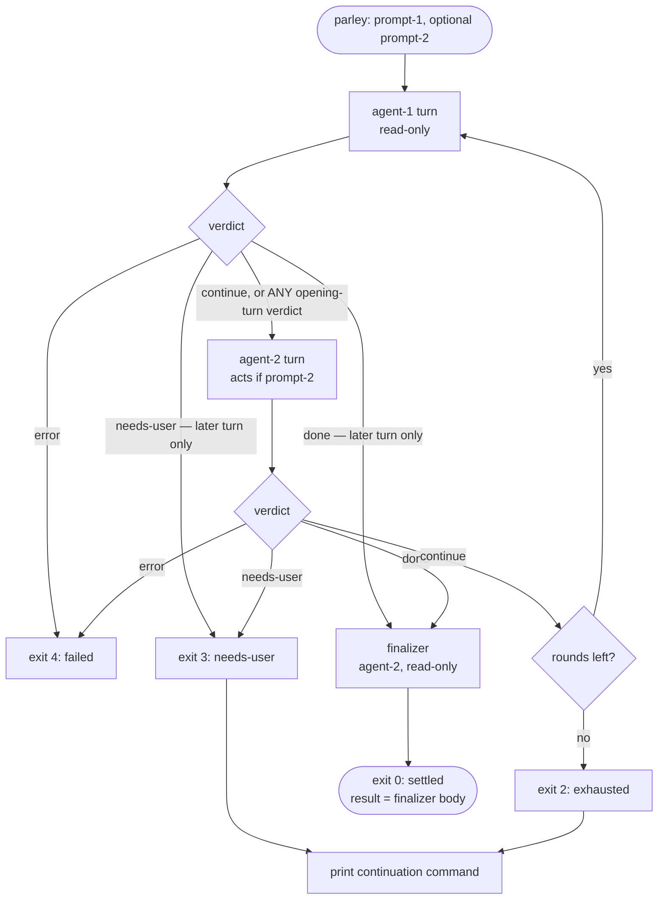
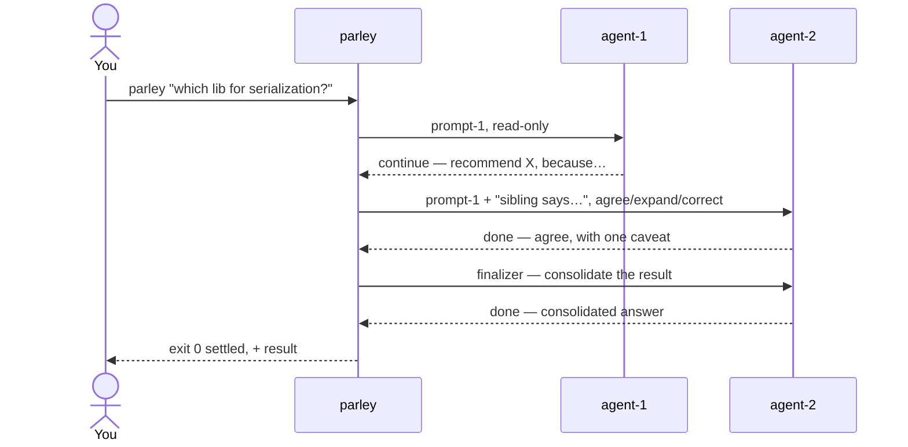
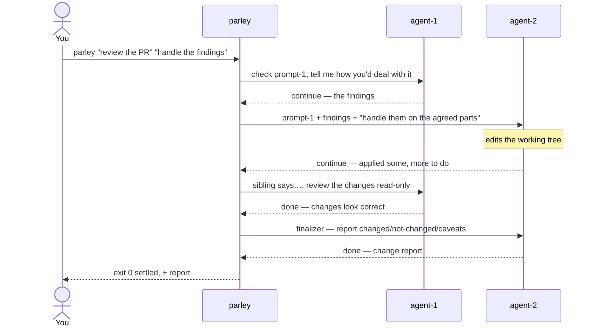

# claude-parley

`parley` is a local CLI harness that runs two coding agents — Codex (`codex`) and Claude Code
(`claude`) — against the same task in a bounded, alternating **relay**, and escalates to you only
when they cannot converge. It is a developer tool, not a deployable agent: it shells out to the
local CLIs non-interactively, never calls a model API directly, and never edits source files itself.

## Install

```bash
npm install
npm run check      # typecheck + build + tests (mock runners; no real CLIs needed)
```

Requires Node ≥ 24 and the `codex` / `claude` CLIs on PATH for real runs.

## Usage

```bash
# Read-only deliberation (no second prompt → nobody edits files):
parley "which lib (if any) should we use for serialization?"

# Action: deliberate, then act on the agreed parts:
parley "review the PR for correctness risks" "handle the findings"
```

**agent-1** (default Codex) opens and stays read-only; **agent-2** (default Claude Code) responds,
acts on the agreed parts when a second prompt is given, and runs the closing finalizer. `--first
claude` swaps which CLI fills which slot.

### Options

| Option | Default | Meaning |
|---|---|---|
| `--rounds <n>` | `5` | Max rounds; one round = agent-1 turn + agent-2 turn. |
| `--first <codex\|claude>` | `codex` | Which CLI is agent-1 (the read-only opener). |
| `--claude-session <id>` | — | Resume Claude's side (both-or-neither with `--codex-session`). |
| `--codex-session <id>` | — | Resume Codex's side (both-or-neither with `--claude-session`). |
| `--output <path>` | — | Write the stable JSON result document. |
| `--steps-output <path>` | — | Write the per-turn steps array. |
| `--verbose` | off | Diagnostics to stderr. |

### Outcomes & exit codes

- `0` **settled** — a responding turn returned `done`; the finalizer ran (its body is the result).
- `2` **exhausted** — rounds ran out with no `done` (budget exhausted, not necessarily disagreement).
- `3` **needs-user** — a turn returned `needs-user`; a human decision is required.
- `4` **failed** — a coding-agent invocation failed unrecoverably.
- `1` — usage error (bad args, or mixed resume).

On `exhausted` / `needs-user`, stdout ends with a ready-to-run **continuation command** (both
session ids pre-filled) so you can resume the same deliberation with new guidance.

## Execution flow

The relay alternates agent‑1 (opener, read‑only) and agent‑2 (responder/actor), checking each
turn's verdict. The **opening turn can only continue or fail** — a `done` or `needs-user` there is
deferred to agent‑2 (which may resolve it), so only an `error` stops on the opener. The relay
settles as soon as a *responding* turn returns `done`, then a finalizer turn produces the
deliverable.



### Read-only walkthrough — `parley "which lib for serialization?"`

Both slots only deliberate; the finalizer consolidates the converged answer. Nothing is edited.



### Action walkthrough — `parley "review the PR" "handle the findings"`

agent‑1 reviews read‑only; agent‑2 acts on the agreed parts each turn; the finalizer reports what
changed, what didn't, and any caveats.



## How it works

- A **round** is one agent-1 turn then one agent-2 turn. Each turn returns a structured verdict
  whose `status` is `continue` (something material remains) or `done` (nothing material remains).
- The relay **settles** as soon as the *responding* turn returns `done` (the opener can't settle),
  then runs a read-only **finalizer** on agent-2 — consolidating the answer (read-only flow) or
  reporting what changed / didn't / caveats (action flow).
- The verdict is enforced by each CLI's native structured output (`codex exec --output-schema`,
  `claude --json-schema`). Claude drops structured output on any `--resume` turn that uses tools, so
  the Claude runner also asks for a fenced ```json verdict block and parses that as a fallback.

### Phase 1 caveats

- parley injects **no** permission/sandbox flags; it inherits your `codex` / `claude` CLI config,
  which must permit non-interactive runs and let agent-2 edit. agent-1's read-only behavior is
  prompt-advisory in phase 1; structural enforcement is phase 2.
- Resume is **both-or-neither** (a fresh run, or a continuation of both sessions).
- The acceptance gate — an agent editing files **and** returning a conforming verdict in one
  invocation — is covered by a skipped integration test (`test/acceptance.integration.test.ts`).
