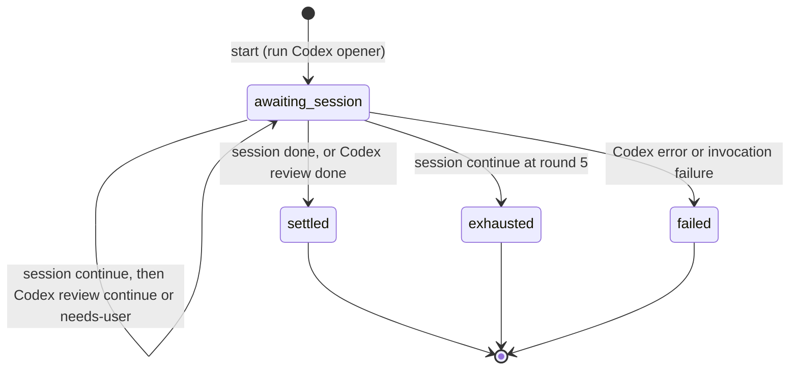

# consult-codex — protocol reference

Maintainer reference for the `consult-codex-step` helper: the loop, verdict types, the exact Codex
prompts, the on-disk state, resume, and error handling. The session-facing instructions live in
[SKILL.md](SKILL.md); this file documents what the helper does so it can be changed safely.

## Roles and the loop

| Role | Who | Edits files? | Opens? |
|---|---|---|---|
| **Codex** | the read-only second coding agent, via `codex exec` (subprocess) | never | yes |
| **session** | the live Claude Code session | only in action mode | no (always responds) |

"Read-only" bounds Codex's *file access*, not its remit: it reviews and validates, and also expands
on findings, suggests ideas, and flags risks.

A **round** = one Codex turn then one session turn; budget **5 rounds**. After each turn the helper
checks the verdict's `status`:

- `done` → converged → the session writes the **finalizer** (settle).
- `error` / invocation failure → **failed** (immediately).
- `continue` → take the next turn.
- `needs-user` (Codex only) → handed to the session, which resolves it inline.

The **opening Codex turn cannot end the run** — the session always responds to it. So settle,
exhaust, and any escalation are only reached via a *responding* (session) turn. Five rounds with no
`done` ⇒ **exhausted**.

## Verdict and StepResult types

```ts
type CodexStatus = "continue" | "done" | "needs-user" | "error";

// Codex's verdict — enforced by codex exec --output-schema, read from --output-last-message.
type CodexVerdict = { status: CodexStatus; summary: string; reason: string; body: string };

// The session's verdict — deliberately SMALLER: it only ever reports continue/done (it resolves
// needs-user inline and never "errors"); `reason` is dropped because `body` is the report.
type SessionVerdict = { status: "continue" | "done"; summary: string; body: string };

// Exactly one StepResult is printed (as one JSON line) per invocation. Terminal phases carry enough
// context for the session to write the finalizer / report without re-deriving state.
type StepResult =
  | { phase: "session-turn"; runId: string; round: number; codex: CodexVerdict }
  | { phase: "settled"; runId: string; round: number;
      closing: { source: "codex" | "session"; verdict: CodexVerdict | SessionVerdict } }
  | { phase: "exhausted"; runId: string; round: number;
      lastCodexVerdict: CodexVerdict; lastSessionVerdict: SessionVerdict }
  | { phase: "failed"; runId: string; round: number; error: string };
```

## State machine

Re-entrant over the per-run state file. Each invocation: load state → do the one deterministic action
for the current state → persist → print the next `StepResult`.



- **start** (`--task … [--action …]`): mint a local UUID `runId`, write the state file **before**
  invoking Codex, run the Codex **opener** (no thread), capture the thread id into `codexThread`. The
  opener cannot terminate except on a Codex `error` (→ `failed`). Otherwise → `awaiting-session`,
  return `{ phase:"session-turn", round:1, codex }`.
- **awaiting-session** (`--run <id> --verdict <SessionVerdict>`): record the verdict.
  - `done` → `settled`, `closing.source = "session"`.
  - `continue` and `round == 5` → `exhausted`.
  - `continue` otherwise → `round += 1`, run the Codex **review** (resume the thread):
    - review `done` → `settled`, `closing.source = "codex"`.
    - review `continue` / `needs-user` → `awaiting-session`, `{ phase:"session-turn", round, codex }`.
    - review `error` → `failed`.
- **terminal** (`settled` / `exhausted` / `failed`): the exact terminal `StepResult` is stored in
  `terminalResult`; re-invocation (e.g. a cross-session resume of a finished run) replays it verbatim.

## Codex prompts

The wording **is** the protocol.

**Opener** (round 1, fresh):

> You are the read-only second agent in a two-agent deliberation. You may not edit files — but beyond
> reviewing, feel free to validate the approach, expand on it, surface considerations, suggest
> concrete ideas, and flag risks.
>
> Task:
> `<task>`
>
> Give your assessment and state your position. Set `status` = `done` if there is nothing material to
> add, `continue` if there is more to add or address (be concrete in `body`), or `needs-user` if a
> genuinely human decision is required.

**Review** (round > 1, resume):

> You are the read-only second agent — you may not edit files. Review and validate the work, and
> suggest improvements or ideas where useful.
>
> Task:
> `<task>`  _(action mode appends a line: "Requested action: `<action>`")_
>
> Your sibling agent (the Claude Code session) just did:
> `<session.body>`
>
> Inspect the current working tree read-only and judge whether it now satisfies the task. Set
> `status` = `done` if nothing material remains, `continue` if there is more to add or address (be
> concrete in `body`), or `needs-user` if a genuinely human decision is required.

## The Codex turn

- New: `codex exec --json --output-schema <tmp-schema> --output-last-message <tmp-last> "<prompt>"`;
  capture the thread id from the first `thread.started` event of the `--json` stream.
- Resume: `codex exec resume <codexThread> --json --output-schema <tmp-schema> --output-last-message <tmp-last> "<prompt>"`.
- The verdict is the JSON written to the last-message file, validated against the schema
  `{ status, summary, reason, body }`.
- Spawned with stdin closed. A non-zero exit, unparseable verdict, or thread-capture failure →
  `{ phase:"failed", error }`, leaving the state file intact.
- No `--sandbox` flag is injected: Codex's read-only stance is conveyed by the prompt and bounded by
  the operator's `codex` config — a deliberate non-goal to keep the tool simple, not an oversight.

## State, location, and privacy

State lives **outside the working tree** at
`${XDG_STATE_HOME:-~/.local/state}/consult-codex/<run-id>.json`. The directory is created `0700` and
each file `0600` (the file holds task/action/verdict text). Storing it outside the repo means no repo
pollution and no review context in version control.

```jsonc
{
  "runId": "…",                 // local UUID, minted before Codex runs
  "cwd": "/abs/path/to/repo",   // resume must run here
  "task": "<task>",
  "action": "<action> or null",
  "round": 2,
  "codexThread": "<id> or null (until the opener captures it)",
  "state": "awaiting-session | settled | exhausted | failed",
  "lastCodexVerdict":   { "status": "continue", "summary": "…", "reason": "…", "body": "…" },
  "lastSessionVerdict": { "status": "continue", "summary": "…", "body": "…" }, // or null until the first session turn
  "transcriptDigest": [ { "round": 1, "agent": "codex", "summary": "…" } ],
  "terminalResult": null        // once terminal, the exact StepResult to replay
}
```

## Resume and error handling

- `--resume <run-id>` returns the pending phase (typically `session-turn` with the last Codex review)
  or the stored `terminalResult`. Codex resumes via `codexThread`; the session rehydrates from
  `transcriptDigest`. Resume must run from the recorded `cwd`; the helper warns if it differs.
- A Codex failure (non-zero exit / unparseable verdict / thread-capture failure) → `failed`; the
  session reports the error and run id, and the state file remains for inspection. The session's own
  turns never "fail" — if it cannot proceed it asks the user.

## Validation

The state machine is unit-testable with crafted state files plus a **fake `codex`** stub on PATH (a
script that emits a canned `thread.started` line and writes a canned last-message verdict) — no real
Codex needed. Cover every transition: opener, session done/continue, review done/continue/needs-user/
error, round-5 exhaust, and terminal replay.
